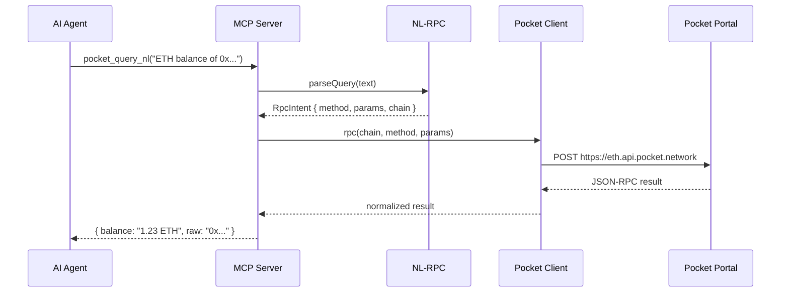
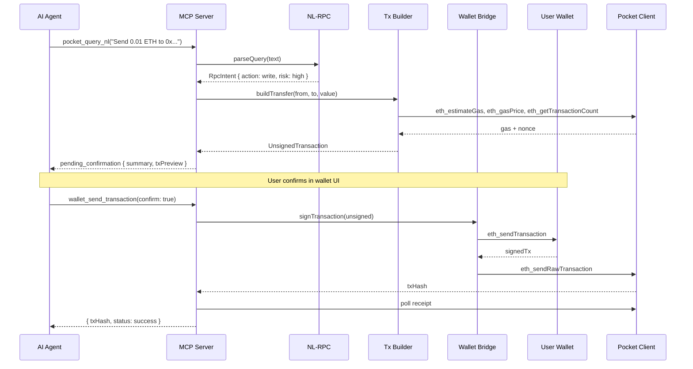

# Architecture — AI & Agents MCP × Pocket

Technical architecture for the pokt-mcp monorepo.

---

## Monorepo Layout

```
pokt-mcp/
├── packages/
│   ├── pocket-client/      # Pocket JSON-RPC HTTP client + chain registry
│   ├── mcp-server/         # MCP tool server (stdio + SSE)
│   ├── nl-rpc/             # Natural language → RpcIntent
│   ├── wallet-bridge/      # WalletConnect + tx build/sign/broadcast
│   └── agent-orchestrator/ # Reference agent loop (optional)
├── examples/
│   ├── cursor-mcp.json     # Cursor MCP configuration
│   └── agent-cli/          # Minimal CLI demo
├── docs/
│   ├── DESIGN.md
│   ├── ARCHITECTURE.md
│   ├── MCP_TOOLS.md
│   └── SECURITY.md
└── package.json            # npm workspaces root
```

---

## Data Flow — Read Query



---

## Data Flow — Send Transaction



---

## Package Boundaries

### `pocket-client`

**Exports:**

```typescript
interface PocketClient {
  rpc<T>(chain: string, method: string, params?: unknown[]): Promise<T>;
  batch(chain: string, calls: RpcCall[]): Promise<RpcResult[]>;
  getEndpoint(chain: string): string;
}

interface ChainRegistry {
  list(): ChainInfo[];
  get(slug: string): ChainInfo | undefined;
  resolve(alias: string): ChainInfo | undefined;
}
```

**Dependencies:** none (pure HTTP + static registry)

### `nl-rpc`

**Exports:**

```typescript
interface NlRpcEngine {
  parse(query: string, context?: SessionContext): Promise<RpcIntent>;
  explain(method: string, params: unknown[], chain: string): string;
}
```

**Dependencies:** `pocket-client` (for ENS resolution calls), optional LLM API

### `wallet-bridge`

**Exports:**

```typescript
interface WalletBridge {
  getStatus(): WalletStatus;
  connect(): Promise<ConnectResult>;      // WC URI or injected
  disconnect(): Promise<void>;
  switchChain(chainId: number): Promise<void>;
  signMessage(message: string): Promise<string>;
  signTransaction(tx: UnsignedTransaction): Promise<SignedTransaction>;
}
```

**Dependencies:** `@walletconnect/sign-client`, `viem` (EVM encoding)

### `mcp-server`

**Exports:** MCP server entrypoints

- `bin/pokt-mcp.js` — stdio transport
- `bin/pokt-mcp-sse.js` — HTTP/SSE for web UI

**Dependencies:** `@modelcontextprotocol/sdk`, all internal packages

---

## Chain Registry Schema

```typescript
interface ChainInfo {
  slug: string;              // "eth", "base", "solana"
  name: string;              // "Ethereum Mainnet"
  chainId?: number;          // EVM only
  nativeSymbol: string;      // "ETH"
  protocol: "evm" | "solana" | "cosmos";
  endpoint: string;          // computed: https://{slug}.api.pocket.network
  aliases: string[];         // ["ethereum", "mainnet", "1"]
  blockExplorer?: string;
}
```

Registry is JSON in `packages/pocket-client/src/registry/chains.json`, regenerated from Pocket's public chain list.

---

## RPC Method Coverage

### EVM — Full JSON-RPC

All standard methods via `pocket_rpc_call`:

| Category | Methods |
|----------|---------|
| **Chain** | `eth_chainId`, `eth_blockNumber`, `eth_syncing` |
| **Blocks** | `eth_getBlockByNumber`, `eth_getBlockByHash`, `eth_getBlockTransactionCountBy*` |
| **Transactions** | `eth_getTransactionByHash`, `eth_getTransactionReceipt`, `eth_getTransactionByBlock*` |
| **Accounts** | `eth_getBalance`, `eth_getTransactionCount`, `eth_getCode`, `eth_getStorageAt` |
| **Calls** | `eth_call`, `eth_estimateGas` |
| **Gas** | `eth_gasPrice`, `eth_maxPriorityFeePerGas`, `eth_feeHistory` |
| **Logs** | `eth_getLogs` |
| **Tx submit** | `eth_sendRawTransaction`, `eth_sendTransaction` (via wallet) |
| **Filters** | `eth_newFilter`, `eth_getFilterChanges`, … |
| **Proofs** | `eth_getProof` |
| **Traces** | `debug_*`, `trace_*` (if node supports; may be unavailable on public portal) |

### Solana

Via `pocket_rpc_call` on `solana` slug:

- `getBalance`, `getAccountInfo`, `getTransaction`, `getBlock`, `getLatestBlockhash`
- `sendTransaction` (with wallet-signed tx)

### Cosmos

REST/LCD via Pocket where available; gRPC for advanced queries.

---

## MCP Transport

| Transport | Command | Consumer |
|-----------|---------|----------|
| **stdio** | `npx @pokt-mcp/server` | Cursor, Claude Desktop |
| **SSE** | `npx @pokt-mcp/server --sse --port 3001` | Web chat UI |

Cursor config (`examples/cursor-mcp.json`):

```json
{
  "mcpServers": {
    "pokt-mcp": {
      "command": "npx",
      "args": ["-y", "@pokt-mcp/server"],
      "env": {
        "POCKET_DEFAULT_CHAIN": "eth",
        "WALLETCONNECT_PROJECT_ID": "${WALLETCONNECT_PROJECT_ID}"
      }
    }
  }
}
```

---

## Error Handling

All MCP tools return structured errors:

```typescript
interface PoktMcpError {
  code: "CHAIN_NOT_FOUND" | "RPC_ERROR" | "POLICY_DENIED" |
        "WALLET_NOT_CONNECTED" | "USER_REJECTED" | "NL_PARSE_FAILED";
  message: string;
  details?: unknown;
}
```

JSON-RPC errors from Pocket are wrapped, not thrown raw, so agents can retry or explain failures in natural language.

---

## Observability

| Signal | Implementation |
|--------|----------------|
| Request logging | Pino structured logs per tool call |
| Metrics | Prometheus counters: `pocket_rpc_calls_total{chain,method,status}` |
| Tracing | OpenTelemetry spans: MCP tool → Pocket HTTP |
| Audit | Append-only log for all write operations |

---

## Scaling & Reliability

| Concern | Strategy |
|---------|----------|
| Pocket portal rate limits | Exponential backoff; optional dedicated PATH endpoint |
| Chain unavailable | Fallback RPC from env; clear error to agent |
| Wallet session expiry | Auto-reconnect prompt via `wallet_get_status` |
| NL misparsing | Agent can fall back to explicit `pocket_rpc_call` |

---

## Tech Stack

| Layer | Choice | Rationale |
|-------|--------|-----------|
| Language | TypeScript | MCP SDK, viem, strong typing for tool schemas |
| Runtime | Node.js ≥20 | MCP stdio, WalletConnect |
| EVM encoding | viem | Modern, tree-shakeable, typed ABI |
| MCP SDK | `@modelcontextprotocol/sdk` | Official spec |
| HTTP | native `fetch` | No extra deps |
| Monorepo | npm workspaces | Simple, no turbo requirement for v1 |
