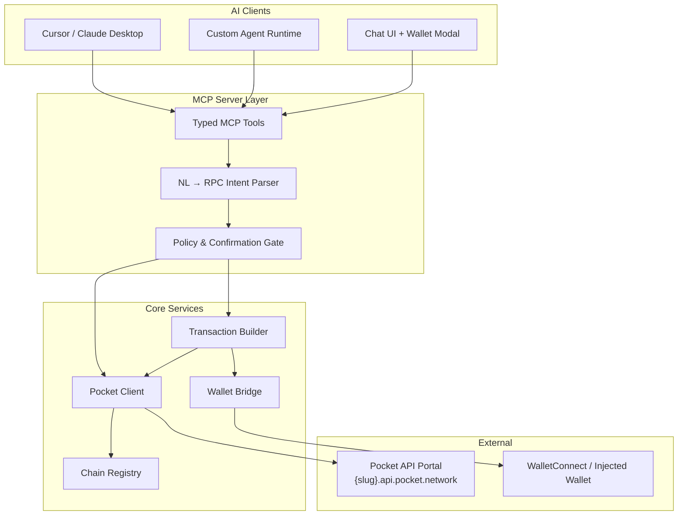
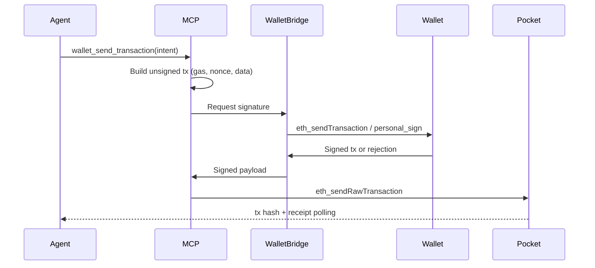

# AI & Agents — MCP × Pocket × Natural Language RPC

Design for an AI-native blockchain access layer: MCP tools backed by Pocket Network's decentralized RPC portal, with natural language query translation, wallet connect/sign/send, and full JSON-RPC coverage across 60+ chains.

---

## Problem

AI agents need reliable, multi-chain blockchain access without:

- Hardcoding RPC URLs per chain
- Letting the model invent RPC methods or parameters
- Exposing private keys in agent context
- Mixing read-only queries with destructive writes without guardrails

Pocket Network's Shannon-era public portal (`https://{chain-slug}.api.pocket.network`) provides keyless, decentralized JSON-RPC across 60+ networks — an ideal transport layer for agent tooling.

---

## Goals

| Goal | Description |
|------|-------------|
| **MCP-first** | Expose chain access as typed MCP tools consumable by Cursor, Claude Desktop, and custom agents |
| **Pocket-native** | Route all chain reads/writes through Pocket portal endpoints with automatic chain discovery |
| **Natural language RPC** | Translate user intent ("What's Vitalik's ETH balance?") into validated JSON-RPC calls |
| **Full RPC surface** | Support arbitrary JSON-RPC methods, not just curated read helpers |
| **Wallet connect & send** | Connect external wallets (WalletConnect / browser inject), build txs, user signs, agent broadcasts |
| **Safe by default** | Read tools open; write tools require explicit user confirmation and policy checks |

---

## Non-Goals (v1)

- Custodial key management or hot wallets with agent-held keys
- MEV protection, private mempools, or advanced DeFi routing
- Non-EVM signing beyond chain-specific adapters (Solana/Cosmos in later phases)
- Running a private PATH gateway (documented as upgrade path, not v1 requirement)

---

## System Overview



---

## Layer Responsibilities

### 1. MCP Server (`packages/mcp-server`)

Single MCP process exposing tools over stdio (Cursor/Claude) or SSE (web). Responsibilities:

- Tool schema definitions (JSON Schema inputs/outputs)
- Request validation and sanitization
- Routing to Pocket client, NL parser, or wallet bridge
- Structured error responses (RPC errors, policy denials, wallet rejections)

### 2. Pocket Client (`packages/pocket-client`)

Thin HTTP client wrapping Pocket's public portal:

- Endpoint pattern: `https://{chain-slug}.api.pocket.network`
- Standard JSON-RPC 2.0 POST
- Chain slug resolution from registry
- Retry with backoff on 429/5xx
- Optional fallback to direct RPC URL from env (`FALLBACK_RPC_URLS`)

### 3. Chain Registry (`packages/pocket-client/src/registry`)

Static + dynamic chain metadata:

- Slug, display name, chain ID, native symbol, protocol (evm | solana | cosmos)
- Common method allowlists per protocol
- Pocket portal availability flag

Source of truth: [Pocket supported chains](https://docs.pocket.network/developers/supported-chains/) + on-chain registry at poktscan.com/services.

### 4. Natural Language RPC (`packages/nl-rpc`)

Converts unstructured user text into **validated intents**, not raw RPC:

```typescript
interface RpcIntent {
  action: "read" | "write";
  chain: string;           // slug or alias, e.g. "eth", "ethereum"
  method: string;          // e.g. "eth_getBalance"
  params: unknown[];
  humanSummary: string;    // for confirmation UI
  riskLevel: "none" | "low" | "high";  // high = sends value or contract calls
}
```

Pipeline:

1. **Resolve chain** — fuzzy match "polygon", "matic", "137" → `poly`
2. **Classify intent** — read vs write via LLM + rule-based overrides
3. **Map to method** — template library + `gateway_execute_rpc` escape hatch
4. **Validate params** — address checksum, hex format, block tag enums
5. **Execute or queue** — reads go straight to Pocket; writes enter confirmation gate

The NL layer never bypasses validation. Unknown intents fall back to `pocket_rpc_call` with explicit method/params supplied by the agent.

### 5. Wallet Bridge (`packages/wallet-bridge`)

Non-custodial signing flow:



Supported connection modes:

| Mode | Use case |
|------|----------|
| **WalletConnect v2** | Mobile / desktop wallets, chat UI |
| **Injected (EIP-1193)** | Browser extension in web UI |
| **Local signer (dev only)** | `PRIVATE_KEY` in env, disabled in production |

Wallet state exposed to MCP as read-only context: connected address, chain ID, connection status.

### 6. Agent Orchestrator (`packages/agent-orchestrator`)

Optional reference agent loop (OpenAI / Anthropic tool-calling):

- Loads MCP tool definitions
- Maintains session memory (last chain, connected wallet)
- System prompt enforcing: never guess addresses, always confirm sends
- Example CLI and chat UI integration

---

## MCP Tool Catalog

Tools are grouped by capability. See [MCP_TOOLS.md](./MCP_TOOLS.md) for full schemas.

### Discovery & Meta

| Tool | Purpose |
|------|---------|
| `pocket_list_chains` | List supported chains with slugs and endpoints |
| `pocket_get_chain` | Metadata for one chain (ID, symbol, protocol) |
| `pocket_list_methods` | Common RPC methods for a chain/protocol |

### Read — Curated (fast path for agents)

| Tool | Maps to |
|------|---------|
| `pocket_get_balance` | `eth_getBalance` / Solana equivalent |
| `pocket_get_block_number` | `eth_blockNumber` |
| `pocket_get_transaction` | `eth_getTransactionByHash` |
| `pocket_get_receipt` | `eth_getTransactionReceipt` |
| `pocket_call_contract` | `eth_call` (view functions) |
| `pocket_get_logs` | `eth_getLogs` |
| `pocket_estimate_gas` | `eth_estimateGas` |

### Read/Write — Full RPC (escape hatch)

| Tool | Purpose |
|------|---------|
| `pocket_rpc_call` | Arbitrary JSON-RPC method + params on any Pocket chain |
| `pocket_batch_rpc` | JSON-RPC batch array (read-heavy analytics) |

### Natural Language

| Tool | Purpose |
|------|---------|
| `pocket_query_nl` | NL string → intent resolution → execute read or return pending write |
| `pocket_explain_rpc` | Explain what a method/params combination would do (no execution) |

### Wallet

| Tool | Purpose |
|------|---------|
| `wallet_get_status` | Connection state, address, chain |
| `wallet_connect` | Initiate WalletConnect session (returns URI) |
| `wallet_disconnect` | Tear down session |
| `wallet_switch_chain` | Request chain switch in connected wallet |
| `wallet_sign_message` | `personal_sign` / EIP-712 typed data |
| `wallet_send_transaction` | Build → confirm → sign → broadcast |
| `wallet_send_raw_transaction` | Broadcast already-signed raw tx |

### Transaction Lifecycle

| Tool | Purpose |
|------|---------|
| `pocket_wait_for_receipt` | Poll until tx confirmed or timeout |
| `pocket_get_nonce` | `eth_getTransactionCount` for tx building |

---

## Natural Language RPC — Intent Templates

Pre-built templates cover ~80% of agent queries. Examples:

| User says | Resolved intent |
|-----------|-----------------|
| "ETH balance of vitalik.eth" | `eth_getBalance` on `eth`, resolve ENS first |
| "Latest block on Base" | `eth_blockNumber` on `base` |
| "Send 0.01 ETH to 0xabc… on mainnet" | Write intent → `wallet_send_transaction` |
| "Call balanceOf on USDC for 0x…" | `eth_call` with encoded ABI |
| "Logs for Transfer events last 1000 blocks" | `eth_getLogs` with computed block range |

Templates live in `packages/nl-rpc/src/templates/`. Each template declares:

- Trigger phrases / slot extractors (address, amount, token, chain)
- Required pre-steps (ENS resolve, token address lookup)
- Output method + param builder
- Risk classification

For unmatched queries, the agent uses `pocket_rpc_call` directly with explicit method names — the NL layer assists but does not block power users.

---

## Security Model

See [SECURITY.md](./SECURITY.md) for full detail. Summary:

| Control | Implementation |
|---------|----------------|
| **No keys in LLM context** | Private keys only in wallet bridge env, never in tool responses |
| **Write confirmation** | `wallet_send_transaction` returns `pending_confirmation` until user approves |
| **Spend limits** | Configurable max value per tx / per session |
| **Method allowlist (optional)** | Deny `debug_*`, `admin_*`, raw key export methods |
| **Address blocklist** | Reject known malicious addresses (optional integration) |
| **Simulation before send** | `eth_call` dry-run for contract interactions when possible |
| **Audit log** | All writes logged with timestamp, address, method, tx hash |

---

## Configuration

```bash
# Pocket
POCKET_PORTAL_BASE=https://api.pocket.network   # default
POCKET_DEFAULT_CHAIN=eth

# Fallback RPCs (comma-separated slug=url)
FALLBACK_RPC_URLS=eth=https://...,poly=https://...

# Wallet
WALLETCONNECT_PROJECT_ID=...
WALLET_ALLOWED_CHAINS=eth,base,arb-one,poly

# Policy
MAX_SEND_VALUE_ETH=1.0
REQUIRE_CONFIRMATION=true
ALLOW_LOCAL_SIGNER=false   # dev only

# Agent
OPENAI_API_KEY=...         # optional, for NL parsing
ANTHROPIC_API_KEY=...
```

---

## Deployment Topologies

### A. Local MCP (developer)

```
Cursor → stdio → mcp-server → Pocket portal
                ↘ wallet-bridge → MetaMask (browser)
```

### B. Hosted MCP + Chat UI

```
Web UI → SSE MCP → mcp-server → Pocket
       ↘ WalletConnect modal
```

### C. Enterprise (high throughput)

Replace public portal with dedicated PATH gateway or Foundation Partnership endpoint — same client, different base URL.

---

## Implementation Phases

### Phase 1 — Read-only MCP + Pocket (MVP)

- [ ] Pocket client + chain registry
- [ ] MCP tools: discovery, curated reads, `pocket_rpc_call`
- [ ] Cursor MCP config example
- [ ] Integration tests against live Pocket portal

### Phase 2 — Natural Language RPC

- [ ] Intent templates for top 20 query patterns
- [ ] `pocket_query_nl` tool
- [ ] ENS / address resolution
- [ ] Risk classification

### Phase 3 — Wallet Connect & Send

- [ ] WalletConnect v2 integration
- [ ] Transaction builder (EVM)
- [ ] Confirmation gate + audit log
- [ ] `wallet_*` MCP tools

### Phase 4 — Multi-protocol & Production Hardening

- [ ] Solana RPC adapter
- [ ] Cosmos REST/gRPC adapter
- [ ] Rate limit handling, caching, metrics
- [ ] Optional PATH gateway config

---

## Success Metrics

| Metric | Target |
|--------|--------|
| Chain coverage | 60+ Pocket portal chains |
| NL query accuracy | >90% on curated template set |
| Read p95 latency | <500ms via Pocket portal |
| Write safety | 0 unsigned broadcasts; 100% user confirmation |
| Agent integration | Works in Cursor + Claude Desktop out of box |

---

## References

- [Pocket API Portal](https://docs.pocket.network/foundation/api-portal/)
- [Supported Chains](https://docs.pocket.network/developers/supported-chains/)
- [Shannon Upgrade](https://docs.pocket.network/get-started/shannon-upgrade/)
- [Model Context Protocol](https://modelcontextprotocol.io)
- Prior art: [chainstacklabs/rpc-nodes-mcp](https://github.com/chainstacklabs/rpc-nodes-mcp), [tatumio/blockchain-mcp](https://github.com/tatumio/blockchain-mcp)
