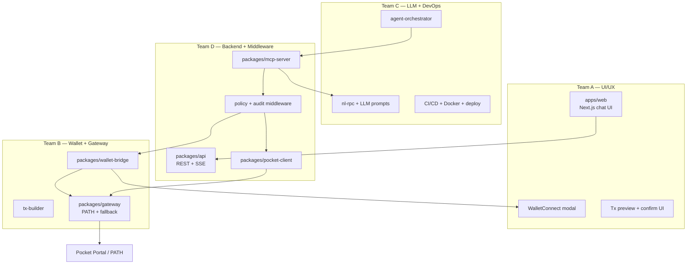
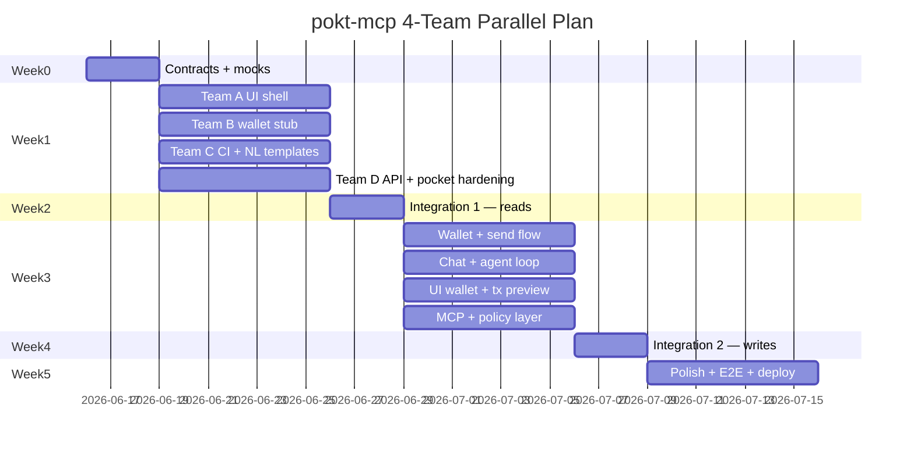

# Development Plan — 4-Team Parallel Build

Plan for building **pokt-mcp** from scratch with four developers working in parallel:

| Team | Focus | Owns |
|------|-------|------|
| **A — UI/UX** | Web chat app, wallet modals, tx previews | `apps/web/` |
| **B — Wallet + Gateway** | WalletConnect, signing, PATH/Pocket gateway | `packages/wallet-bridge/`, `packages/gateway/` |
| **C — LLM + DevOps** | Agent orchestration, NL parsing, CI/CD, deploy | `packages/nl-rpc/`, `packages/agent-orchestrator/`, `infra/`, `.github/` |
| **D — Backend + Middleware** | MCP server, Pocket client, policy layer, REST/SSE API | `packages/pocket-client/`, `packages/mcp-server/`, `packages/api/` |

**Principle:** Contract-first development. Teams ship against typed interfaces and mock servers until integration week — no one blocks on another team's runtime.

---

## System map (who touches what)



---

## Shared contracts (define in Week 0 — all teams)

Before coding features, merge these into `packages/shared/` (new package):

### 1. `packages/shared/src/types.ts`

```typescript
// Chain & RPC
export interface ChainInfo { slug: string; name: string; chainId?: number; protocol: "evm" | "solana" | "cosmos"; endpoint: string; }
export interface RpcIntent { action: "read" | "write"; chain: string; method: string; params: unknown[]; humanSummary: string; riskLevel: "none" | "low" | "high"; }

// Wallet
export interface WalletStatus { connected: boolean; address?: string; chainId?: number; chainSlug?: string; connectionType: "walletconnect" | "injected" | "none"; }
export interface TxPreview { summary: string; to: string; value?: string; data?: string; estimatedGas?: string; chain: string; explorerUrl?: string; }
export interface SendResult { txHash: string; status: "submitted" | "rejected" | "pending"; explorerUrl?: string; }

// API (Team D exposes, Team A consumes)
export interface ChatMessage { id: string; role: "user" | "assistant" | "system"; content: string; toolCalls?: ToolCallResult[]; }
export interface ToolCallResult { tool: string; input: unknown; output: unknown; latencyMs?: number; }

// Errors (all teams use same codes)
export type PoktErrorCode = "CHAIN_NOT_FOUND" | "RPC_ERROR" | "POLICY_DENIED" | "WALLET_NOT_CONNECTED" | "USER_REJECTED" | "NL_PARSE_FAILED";
export interface PoktError { code: PoktErrorCode; message: string; details?: unknown; }
```

### 2. OpenAPI spec — `packages/shared/openapi.yaml`

Team D owns the spec; Team A generates a TypeScript client from it.

| Endpoint | Method | Owner | Consumer |
|----------|--------|-------|----------|
| `/health` | GET | D | C (CI smoke) |
| `/chains` | GET | D | A |
| `/chat` | POST (SSE stream) | D + C | A |
| `/rpc` | POST | D | A (advanced mode) |
| `/wallet/status` | GET | D → B | A |
| `/wallet/connect` | POST | D → B | A |
| `/wallet/tx/preview` | POST | D → B | A |
| `/wallet/tx/send` | POST | D → B | A |

### 3. Mock servers (Week 1)

| Mock | Owner | Location | Used by |
|------|-------|----------|---------|
| Pocket RPC stub | D | `packages/pocket-client/mocks/` | B, C, D |
| Wallet bridge stub | B | `packages/wallet-bridge/mocks/` | A, D |
| NL parser stub | C | `packages/nl-rpc/mocks/` | D |
| Full API mock | D | `packages/api/mocks/` | A, C |

---

## Repo layout after Week 0 scaffold

```
pokt-mcp/
├── apps/
│   └── web/                    # Team A
├── packages/
│   ├── shared/                 # Week 0 — all teams
│   ├── pocket-client/          # Team D
│   ├── gateway/                # Team B
│   ├── wallet-bridge/          # Team B
│   ├── tx-builder/             # Team B
│   ├── mcp-server/             # Team D
│   ├── api/                    # Team D (REST + SSE for web)
│   ├── nl-rpc/                 # Team C
│   └── agent-orchestrator/     # Team C
├── infra/                      # Team C
│   ├── docker/
│   └── terraform/              # optional
├── .github/workflows/          # Team C
└── docs/
```

---

## Phase timeline



---

## Team A — UI/UX

**Goal:** Chat-first web app where users ask chain questions in natural language, see structured results, connect a wallet, and confirm sends.

### Stack
- Next.js 15 (App Router), React 19, Tailwind CSS, shadcn/ui
- `@tanstack/react-query` for API state
- `@walletconnect/modal` (integrates with Team B's bridge via API)
- OpenAPI-generated client from `packages/shared/openapi.yaml`

### Deliverables by week

| Week | Tasks | Done when |
|------|-------|-----------|
| **0** | Review OpenAPI spec; set up `apps/web` with layout, design tokens, dark mode | App runs on `:3000`, design system documented in `apps/web/DESIGN.md` |
| **1** | Chat shell: message list, input, streaming SSE consumer (mock API) | Can send message → see streamed mock response |
| **2** | Chain picker, RPC result cards (balance, block, tx, logs), error states | Read query UX complete against mock API |
| **3** | Wallet connect button + QR modal; wallet status chip; chain switch UI | Connect flow works against mock `/wallet/*` |
| **4** | Tx preview card (to, value, gas, chain, explorer link); confirm/reject buttons | Write preview UX complete |
| **5** | Loading skeletons, mobile layout, accessibility pass, demo recording | Lighthouse a11y ≥ 90; demo script in README |

### Key screens

1. **Chat** — primary interface; supports markdown + structured JSON blocks for RPC results
2. **Wallet drawer** — address, chain, disconnect
3. **Tx confirmation modal** — mandatory for any write; shows full address (no truncation)
4. **Advanced panel** (collapsible) — raw `pocket_rpc_call` for power users

### Dependencies on other teams

| Need | From | Fallback |
|------|------|----------|
| REST + SSE API | D | Use `packages/api/mocks/` |
| Wallet connect URI | B via D | Mock QR string |
| Design copy for risk levels | C | Static strings in Week 1–2 |

### Branch strategy
`team-a/<feature>` → PR to `main`; no direct edits to `packages/wallet-bridge` or `packages/pocket-client`.

---

## Team B — Wallet Connect + Gateway

**Goal:** Non-custodial wallet integration and reliable Pocket routing (public portal + optional PATH gateway + fallbacks).

### Stack
- viem (EVM tx encoding, address checksum, gas estimation helpers)
- `@walletconnect/sign-client` v2 + `@walletconnect/modal`
- Optional: PATH gateway config (Go PATH binary or HTTP proxy to dedicated endpoint)

### Deliverables by week

| Week | Tasks | Done when |
|------|-------|-----------|
| **0** | Finalize `WalletBridge` interface in `packages/shared`; publish mock | Mock returns deterministic connect URI + fake signature |
| **1** | `packages/tx-builder`: build transfer, contract call, gas/nonce fetch via pocket-client | Unit tests pass for ETH transfer build |
| **2** | WalletConnect v2 session: connect, disconnect, getStatus, switchChain | Mobile wallet can scan QR and connect on testnet |
| **3** | signMessage (EIP-191), signTransaction (EIP-1559), sendRawTransaction via gateway | End-to-end sign + broadcast on Sepolia/Base |
| **4** | `packages/gateway`: portal routing, fallback RPC map, retry/backoff, optional PATH URL override | Gateway routes 3 chains with fallback tested |
| **5** | Spend limit enforcement, audit log hook, injected wallet (EIP-1193) for browser | Policy rejects over-limit txs; audit entries emitted |

### Package breakdown

```
packages/gateway/
  src/
    portal.ts       # https://{slug}.api.pocket.network
    path.ts         # optional PATH gateway URL
    fallback.ts     # env-based direct RPC fallback
    router.ts       # pick endpoint, health check, failover

packages/wallet-bridge/
  src/
    walletconnect.ts
    injected.ts
    index.ts        # WalletBridge impl

packages/tx-builder/
  src/
    transfer.ts
    contract.ts
    estimate.ts
```

### Dependencies on other teams

| Need | From | Fallback |
|------|------|----------|
| Pocket RPC for gas/nonce | D (`pocket-client`) | Hardcode Sepolia endpoint temporarily |
| Policy limits config shape | D | Local env vars |
| API routes exposing wallet | D | Expose bridge directly for B's integration tests |

### Security checklist (Team B owns)
- [ ] Private keys never logged
- [ ] WalletConnect session scoped to allowed chains
- [ ] `confirm: true` required before broadcast
- [ ] Reject zero-address sends

---

## Team C — LLM + DevOps

**Goal:** Agent loop that calls MCP tools intelligently, NL→RPC parsing with LLM fallback, and production-ready CI/CD.

### Stack
- OpenAI / Anthropic SDK (tool-calling)
- `@modelcontextprotocol/sdk` (MCP client for agent)
- GitHub Actions, Docker, optional Fly.io / Railway / Vercel
- Vitest + Playwright (E2E with Team A)

### Deliverables by week

| Week | Tasks | Done when |
|------|-------|-----------|
| **0** | CI pipeline: lint, typecheck, build all packages, unit tests on PR | Green CI on every PR |
| **1** | Expand NL templates (20 patterns); template-only parser (no LLM) | 90% accuracy on fixture set in `packages/nl-rpc/fixtures/` |
| **2** | LLM fallback parser: structured output → `RpcIntent`; system prompt v1 | Ambiguous queries resolve correctly in eval set |
| **3** | `agent-orchestrator`: tool-calling loop, session memory, MCP client over stdio/SSE | CLI agent answers "latest block on Base" via real MCP |
| **4** | Agent guardrails: tool allowlist, write confirmation prompt injection, eval suite | Agent never calls `wallet_send_transaction(confirm:true)` without user text confirmation |
| **5** | Docker Compose (api + web + mcp), staging deploy, smoke tests, observability (logs/metrics) | Staging URL passes smoke test; Grafana/Datadog optional |

### NL template priority (Week 1)

1. `eth_blockNumber` — "latest block on {chain}"
2. `eth_getBalance` — "balance of {address} on {chain}"
3. `eth_getTransactionByHash` — "transaction {hash}"
4. `eth_gasPrice` — "gas price on {chain}"
5. `eth_call` — "call {function} on {contract}"
6. `eth_getLogs` — "Transfer events for {token}"
7. ENS resolve — "{name}.eth balance"
8. Send intent — "send {amount} {symbol} to {address}" → write intent (no execute)

### DevOps deliverables

| Artifact | Location |
|----------|----------|
| PR checks | `.github/workflows/ci.yml` |
| Docker images | `infra/docker/Dockerfile.api`, `Dockerfile.mcp` |
| Local dev stack | `docker-compose.yml` |
| Env docs | `docs/DEPLOYMENT.md` |
| Smoke test | `scripts/smoke-test.sh` — hits `/health`, `/chains`, MCP `pocket_get_block_number` |

### Dependencies on other teams

| Need | From | Fallback |
|------|------|----------|
| MCP server running | D | Start local `@pokt-mcp/server` in CI |
| API for agent SSE chat | D | Agent uses MCP stdio only in Week 3 |
| UI for E2E | A | Playwright tests against mock UI |

---

## Team D — Backend + Middleware

**Goal:** MCP server, Pocket client, HTTP API middleware, policy/audit layer — the glue between all teams.

### Stack
- Node.js 20+, TypeScript, `@modelcontextprotocol/sdk`
- Fastify or Hono for `packages/api` (REST + SSE)
- Zod validation, Pino logging

### Deliverables by week

| Week | Tasks | Done when |
|------|-------|-----------|
| **0** | Create `packages/shared`, `packages/api` skeleton; publish OpenAPI spec + mock server | Mock API runs on `:3001`; A can codegen client |
| **1** | Harden `pocket-client`: full chain registry (60+), retry, caching, `broadcast()` | Integration tests pass against live Pocket portal |
| **2** | MCP server: all read tools + `pocket_rpc_call` + SSE transport | Cursor connects via stdio; web connects via SSE |
| **3** | Policy middleware: denylist, spend limits, confirmation gate; audit log | Write tools blocked without confirm; audit file written |
| **4** | API routes: `/chat` (SSE → agent), `/wallet/*` (delegate to Team B bridge), `/rpc` | A's web app works against real API locally |
| **5** | Rate limiting, request tracing, error normalization, load test (100 concurrent reads) | p95 read latency < 800ms; no uncaught exceptions |

### Middleware stack (request flow)

```
HTTP/MCP request
  → auth (optional API key)
  → request ID + logging
  → Zod validation
  → policy check (method denylist, chain allowlist)
  → handler (pocket / wallet / nl)
  → audit (writes only)
  → normalized PoktError on failure
```

### Dependencies on other teams

| Need | From | Fallback |
|------|------|----------|
| WalletBridge impl | B | Use existing stub in `wallet-bridge` |
| NL parser | C | Pass-through: require explicit RPC in `/chat` until Week 3 |
| UI for manual testing | A | curl / Postman |

---

## Integration milestones

### Integration 1 — Read path (end of Week 2)

**Participants:** All teams  
**Demo script:**
1. User opens web app (A)
2. Types: "What's the latest block on Ethereum?"
3. API (D) → NL parser (C) → MCP tool → Pocket (D/B gateway) → result
4. UI renders block number card (A)

**Exit criteria:**
- [ ] 3 chains working (eth, base, poly)
- [ ] NL template hits for block + balance queries
- [ ] CI green on `main`

### Integration 2 — Write path (end of Week 4)

**Demo script:**
1. User connects wallet via QR (A + B)
2. Types: "Send 0.001 ETH to 0x… on Sepolia"
3. Agent returns tx preview (C + D)
4. User confirms in UI (A) → wallet signs (B) → broadcast via gateway (B) → receipt polled (D)
5. UI shows tx hash + explorer link (A)

**Exit criteria:**
- [ ] Full confirm → sign → broadcast → receipt flow
- [ ] Audit log entry written
- [ ] Policy rejects over-limit amount

### Integration 3 — Ship (end of Week 5)

- [ ] Staging deploy live (C)
- [ ] Demo video recorded (A)
- [ ] MCP config documented for Cursor (D)
- [ ] 60+ chains in registry (D)
- [ ] E2E Playwright suite green (C + A)

---

## Parallel work rules

1. **Do not edit another team's package** without a PR reviewed by that team owner.
2. **Interface changes** go through `packages/shared` — version bump + Slack/Discord ping.
3. **Feature flags** for incomplete integrations:
   ```bash
   FEATURE_WALLET=true
   FEATURE_NL_LLM=false
   FEATURE_PATH_GATEWAY=false
   ```
4. **Daily 15-min standup:** blockers + interface changes only.
5. **Twice-weekly integration branch:** `integration/YYYY-MM-DD` — all teams merge here for smoke test before `main`.

---

## Branch & PR conventions

| Pattern | Owner | Example |
|---------|-------|---------|
| `team-a/*` | UI/UX | `team-a/chat-sse-streaming` |
| `team-b/*` | Wallet + Gateway | `team-b/walletconnect-v2` |
| `team-c/*` | LLM + DevOps | `team-c/nl-templates-v1` |
| `team-d/*` | Backend + Middleware | `team-d/api-sse-transport` |
| `integration/*` | Rotating (C leads) | `integration/2026-06-23` |

PR requirements:
- CI green
- Typecheck passes
- If touching `packages/shared/openapi.yaml` → Team A regenerates client in same or follow-up PR

---

## Definition of done (project MVP)

| Capability | Owner | Verified by |
|------------|-------|-------------|
| Chat UI with streaming responses | A | E2E test |
| 60+ Pocket chains queryable | D | Integration test |
| Natural language → RPC (top 20 patterns) | C | Fixture eval ≥ 90% |
| Full JSON-RPC via `pocket_rpc_call` | D | MCP tool test |
| WalletConnect connect/disconnect | B | Manual + unit test |
| Tx preview + confirm + send | A + B + D | E2E test |
| Policy + audit on writes | D + B | Unit test |
| Cursor MCP stdio config works | D | Manual in Cursor |
| CI on every PR | C | GitHub Actions |
| Staging deployment | C | Smoke test script |

---

## Risk register

| Risk | Mitigation | Owner |
|------|------------|-------|
| Teams blocked on API | Mock server Week 0 | D |
| WalletConnect browser vs server split | B exposes bridge via D API; A never calls WC directly | B + D |
| NL misparsing sends wrong tx | Template-first; LLM fallback only for reads in v1 | C |
| Pocket portal rate limits | Gateway fallback RPCs (B); cache reads (D) | B + D |
| Scope creep (Solana, Cosmos) | Explicitly post-MVP; EVM only until Integration 3 | All |

---

## Week 0 kickoff checklist (all teams, day 1–3)

- [ ] Clone repo, `npm install`, `npm run build`
- [ ] Read `docs/DESIGN.md`, `docs/ARCHITECTURE.md`, `docs/MCP_TOOLS.md`, `docs/SECURITY.md`
- [ ] Assign team leads; create Discord/Slack channels: `#team-a`, `#team-b`, `#team-c`, `#team-d`, `#integration`
- [ ] Team D creates `packages/shared` + OpenAPI spec PR
- [ ] Each team creates mock/stub PR
- [ ] Team C creates CI workflow PR
- [ ] Agree on feature flag env vars and staging URL naming

---

## Quick reference — who to ask

| Question | Team |
|----------|------|
| "Chat UI looks wrong" | A |
| "Wallet won't connect / tx failed" | B |
| "Agent said the wrong thing / deploy broken" | C |
| "API 500 / MCP tool error / chain not found" | D |
| "Shared type or OpenAPI change" | D proposes → all review |
