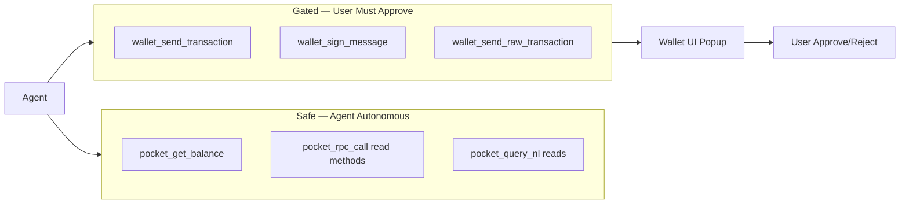

# Security Model

Security architecture for AI agents interacting with blockchains via MCP and Pocket Network.

---

## Threat Model

| Threat | Impact | Mitigation |
|--------|--------|------------|
| Agent sends funds to wrong address | Financial loss | Confirmation gate, address display, optional simulation |
| Private key exfiltration via LLM | Total wallet drain | Never pass keys to model; wallet-only signing |
| Prompt injection → unauthorized tx | Financial loss | Write tools require explicit `confirm: true` + wallet popup |
| Malicious RPC method (e.g. key export) | Key theft | Method denylist; no `personal_*` key export |
| Replay / wrong chain | Failed or wrong tx | Chain ID validation before sign |
| Rug / malicious contract | Token loss | Optional address reputation check; simulation |
| Rate limit / DoS on Pocket | Service degradation | Backoff, caching, fallback RPCs |

---

## Principle: Agents Read, Wallets Write



---

## Key Management

| Rule | Detail |
|------|--------|
| **No keys in prompts** | System prompt forbids requesting or storing private keys |
| **No keys in tool responses** | Tools never return private keys or mnemonics |
| **Local signer dev-only** | `PRIVATE_KEY` env gated behind `ALLOW_LOCAL_SIGNER=true` + warning |
| **Production path** | WalletConnect or injected wallet only |

---

## Write Operation Pipeline

Every write passes through:

1. **Intent validation** — addresses checksum-valid, value within `MAX_SEND_VALUE_*`
2. **Policy check** — method not on denylist, chain in `WALLET_ALLOWED_CHAINS`
3. **Preview generation** — human-readable summary returned to agent/user
4. **Explicit confirmation** — `confirm: true` required on MCP tool call
5. **Wallet signature** — user approves in wallet UI (second confirmation)
6. **Broadcast** — signed tx sent via Pocket `eth_sendRawTransaction`
7. **Audit log** — immutable record of action

---

## Method Denylist (default)

These methods are rejected by `pocket_rpc_call` and wallet tools:

```
personal_importRawKey
personal_listAccounts  (when exposing keys)
eth_sign               (deprecated, signs arbitrary data)
debug_*                (node admin)
admin_*
```

Configurable via `RPC_METHOD_DENYLIST` env (comma-separated).

---

## Spend Limits

```bash
MAX_SEND_VALUE_ETH=1.0          # per transaction, native token
MAX_SEND_VALUE_USD=500          # optional, requires price oracle
MAX_SESSION_SEND_TOTAL_ETH=5.0  # cumulative per MCP session
```

Exceeded limits return `POLICY_DENIED` without reaching wallet.

---

## Address Validation

- EVM: EIP-55 checksum validation
- Reject zero address as transfer destination
- Optional: integrate malicious address DB (e.g. Tatum check, local blocklist)

---

## WalletConnect Security

- Use WalletConnect v2 with verified domain
- Session scoped to `WALLET_ALLOWED_CHAINS`
- Auto-disconnect after `WALLET_SESSION_TIMEOUT_MS` (default 24h)
- Never log WalletConnect symkeys or session secrets

---

## NL-RPC Safety

Natural language parsing cannot bypass gates:

- Write intents return `requiresConfirmation: true` — never auto-execute
- `autoExecute: true` only applies to read intents
- Ambiguous sends (missing amount, invalid address) fail with `NL_PARSE_FAILED`

---

## Audit Log Schema

```json
{
  "timestamp": "2026-06-13T12:00:00Z",
  "tool": "wallet_send_transaction",
  "chain": "eth",
  "from": "0x...",
  "to": "0x...",
  "value": "10000000000000000",
  "txHash": "0x...",
  "status": "submitted",
  "sessionId": "..."
}
```

Stored locally in `~/.pokt-mcp/audit.log` (configurable). Never sent to LLM provider.

---

## Agent System Prompt (recommended)

```
You are a blockchain assistant with MCP tools backed by Pocket Network.

Rules:
- Use pocket_query_nl for natural language chain queries.
- Use pocket_rpc_call for specific JSON-RPC methods.
- NEVER ask users for private keys or seed phrases.
- For any send/swap/contract write: call wallet_send_transaction with confirm:false first,
  show the preview to the user, then confirm:true only after explicit user approval.
- Always display full addresses (0x...) for transfers, never truncate.
- If unsure about chain or address, ask before executing writes.
- Prefer read tools; writes require wallet connection (check wallet_get_status first).
```

---

## Production Checklist

- [ ] `ALLOW_LOCAL_SIGNER=false`
- [ ] `REQUIRE_CONFIRMATION=true`
- [ ] Spend limits configured
- [ ] Method denylist enabled
- [ ] Audit logging enabled
- [ ] WalletConnect project ID from official dashboard
- [ ] HTTPS for SSE transport
- [ ] No private keys in environment on server
- [ ] Agent system prompt includes security rules


---

## Third-party MCP servers

pokt-mcp does not execute token swaps. Users may configure **separate third-party MCP servers** (e.g. Intent MCP by Metalift) for swap flows.

| Concern | pokt-mcp | Third-party MCP |
|---------|----------|-----------------|
| Trust boundary | This repo + Pocket RPC | External provider terms |
| API keys | Pocket / LLM / WalletConnect | Provider-specific (e.g. `INTENT_MCP_API_KEY`) |
| Write operations | Native sends via wallet bridge | Swaps, intents per provider tools |

Review each third-party server's security model before connecting a wallet. pokt-mcp swap execution queries return an error rather than proxying to third-party servers.
